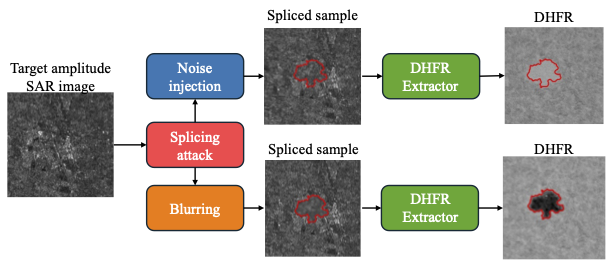

# Interpretability of High-Frequency SAR Residuals
<div align="center">
  
<!-- **Authors:** -->

**_[Edoardo Daniele Cannas](linkedin.com/in/edoardo-daniele-cannas-9a7355146/), [Sara Mandelli](https://www.linkedin.com/in/saramandelli/), [Paolo Bestagini](https://www.linkedin.com/in/paolo-bestagini-390b461b4/), [Stefano Tubaro](https://www.linkedin.com/in/stefano-tubaro-73aa9916/)_**


<!-- **Affiliations:** -->

[Image and Sound Processing Laboratory](http://ispl.deib.polimi.it/)
</div>

Repository for the dataset and code associated with the paper "Interpretability of Deep High-Frequency Residuals: a Case Study on SAR Splicing Localization".  
The repository is currently **under development**, so feel free to open an issue if you encounter any problems.


## Description

This project provides tools and data to analyze the interpretability of high-frequency residuals in deep learning models applied to manipulation localization in SAR (Synthetic Aperture Radar) images. It includes scripts for patch extraction, network models, data management utilities, and analysis notebooks.

## Repository Structure

- `extract_dhfrs.py`: Main script for high-frequency residual extraction.
- `isplutils/`: Python modules for data management, neural networks, and patch extraction.
- `data/poc/`: Examples of manipulated SAR images and reference masks.
- `weights/`: Pre-trained model weights.
- `notebooks/`: Jupyter notebooks for analysis and proof of concept.

## Installation

To install dependencies, use the `environment.yaml` file:

```bash
conda env create -f environment.yaml
conda activate dhfr_interpretability
```

## Usage
1. Download the dataset from [this link (coming soon!)](https://drive.google.com/drive/folders/1JH3jvGk9bX4Yk1yZk3Fqz5g8KX9t2v6?usp=sharing) and place it in the `data/` directory.
2. Extract patches and residuals with `extract_dhfrs.py`.
2. Analyze results using the notebooks in `notebooks/`.
3. Check the modules in `isplutils/` for customization or extensions.